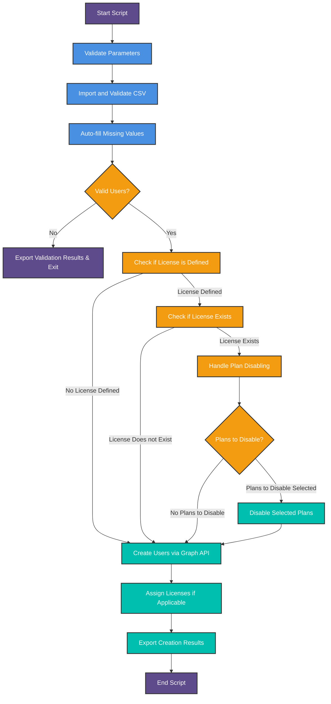
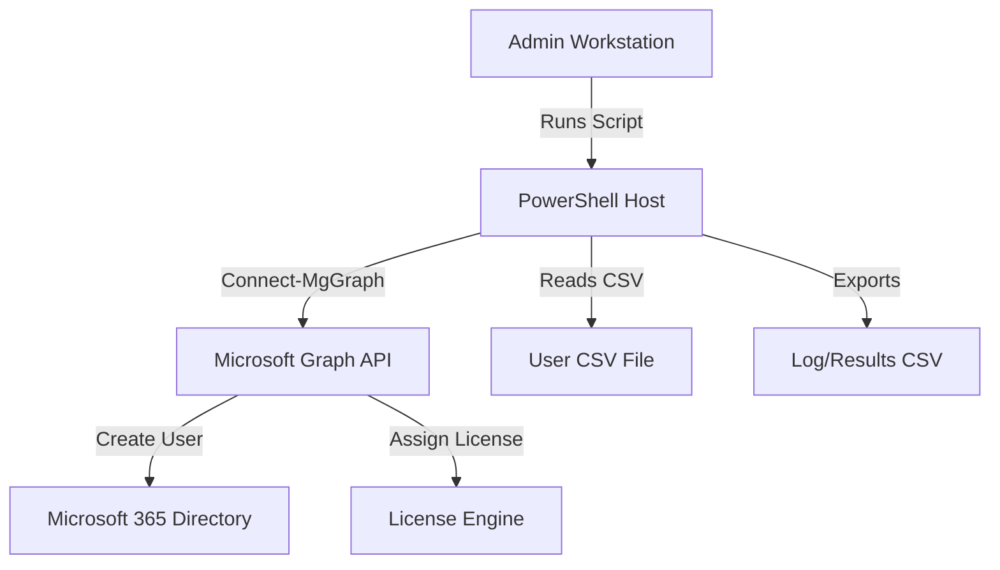

# 📘 Microsoft 365 User Provisioning

## 📄 Overview

This PowerShell script provisions Microsoft 365 user accounts using the Microsoft Graph API. It supports CSV-based batch user creation, password generation, license assignment, service plan disabling, validation, logging, and export of detailed operation results.

---

## 📌 Use Case

- **Environment**: Microsoft 365 (Entra ID/Azure AD)
- **Admins**: IT administrators automating user onboarding
- **Functionality**:
  - Bulk user creation
  - License assignment (manual or prompt)
  - Disable specific service plans
  - Password generation or static assignment
  - Retry logic for throttling
  - Detailed logging and export

---

## 🧾 Prerequisites

| Requirement | Details |
|-------------|---------|
| Modules     | `Microsoft.Graph.Users`, `Microsoft.Graph.Identity.DirectoryManagement`, `Microsoft.Graph.Licensing` |
| Permissions | `User.ReadWrite.All`, `Directory.ReadWrite.All`, `Organization.Read.All` |
| Graph API   | Endpoint used: `https://graph.microsoft.com/v1.0/users` |
| Auth Method | Use `Connect-MgGraph` before execution |
| PowerShell  | Version 5.1+ or PowerShell Core 7+ |

---

## 📂 Script Parameters

### 🔐 Password Parameters

| Parameter                 | Description                                    |
|--------------------------|------------------------------------------------|
| `-Password`              | Assign a static password to all users         |
| `-AutoGeneratePassword`  | Automatically generates a password            |
| `-AutoPasswordLength`    | Length of the auto-generated password (10–20) |
| `-SamePasswordForAll`    | Reuse the same generated password             |
| `-ForcePasswordChange`   | User must change password at first login      |

### 📄 User CSV Parameters

| Parameter              | Description                                          |
|------------------------|------------------------------------------------------|
| `-UserCsvFilePath`     | Required. Path to CSV containing user information   |
| `-ResultExportFilePath`| Optional. Path to export result files               |

### 🧾 License Parameters

| Parameter                         | Description                                               |
|----------------------------------|-----------------------------------------------------------|
| `-AssignedLicenseSkus`           | Assign license(s) directly using SKU ID or part number   |
| `-PromptForAssignedLicenseSkus`  | GUI prompt to select license(s)                          |
| `-DisableLicensePlans`           | Disable specific plans in assigned licenses              |
| `-PromptForDisableLicensePlans`  | GUI prompt to select plans to disable                    |

### 🛠 Logging

| Parameter        | Description                               |
|------------------|-------------------------------------------|
| `-LogFilePath`   | Optional. Custom path for log file        |

---

## 📥 Sample CSV Structure

```csv
UserPrincipalName,DisplayName,MailNickname,GivenName,Surname
john.doe@contoso.com,John Doe,john.doe,John,Doe
```

- **Required Columns**: `UserPrincipalName`, `DisplayName`, `MailNickname`
- **Optional**: `GivenName`, `Surname` (used to auto-fill missing data)

---

## 🔁 Script Execution Flow




---

## ✅ CSV Validation and Auto-Fill Logic

Missing `DisplayName` or `MailNickname` values are auto-generated using:

- `GivenName + Surname` → DisplayName
- `DisplayName` → MailNickname
- `UserPrincipalName` (prefix) → MailNickname (fallback)

Each user is marked as `Valid` or `Invalid` for tracking in the export.

---

## 🧪 Example Scenarios

### Static Password, Direct License

```powershell
.\Create-M365Users.ps1 -UserCsvFilePath ".\Users.csv" -Password "SecureP@ssw0rd" `
    -AssignedLicenseSkus "ENTERPRISEPACK" -ResultExportFilePath ".\results.csv"
```

This example uses a static password for all users and directly assigns the `ENTERPRISEPACK` license.

---

### Auto Password, Prompt License and Plan

```powershell
.\Create-M365Users.ps1 -UserCsvFilePath ".\users.csv" -AutoGeneratePassword `
    -PromptForAssignedLicenseSkus -PromptForDisableLicensePlans -SamePasswordForAll
```

This example automatically generates passwords, prompts the user for license and plan choices, and applies the same password to all users.

---

### **Basic User Creation (Auto-Generated Passwords)**

```powershell
.\Create-M365Users.ps1 -UserCsvFilePath "C:\Users.csv" -AutoGeneratePassword
```

This example auto-generates unique passwords for each user. But no license is assigned

---

### **Assign Licenses & Disable Plans**

```powershell
.\Create-M365Users.ps1 -UserCsvFilePath "C:\Users.csv" -AssignedLicenseSkus "ENTERPRISEPACK" -DisableLicensePlans "EXCHANGE_S_ENTERPRISE"
```

This example assigns the `ENTERPRISEPACK` license and disables the Exchange Online service plan.

---

### **Interactive License Selection**

```powershell
.\Create-M365Users.ps1 -UserCsvFilePath "C:\Users.csv" -PromptForAssignedLicenseSkus -PromptForDisableLicensePlans
```

This example opens an interactive prompt for the user to select license SKUs and disable specific plans.

---

### **Same Password for All Users**

```powershell
.\Create-M365Users.ps1 -UserCsvFilePath "C:\Users.csv" -AutoGeneratePassword -SamePasswordForAll
```

This example generates a single password and applies it to all users.

---

## 📁 Output Files

- **Log File**: `UserCreationLogInf_YYYYMMDD.log`
- **Validation CSV**: `Detailed_ProcessUser-YYYY_MM_dd_HH.csv`
- **Created Users Report**: `CreatedUserAccountInfo-YYYY_MM_dd_HH.csv`

Each file includes timestamping and safe file naming to prevent overwrites.

---

## 🔄 Retry Logic Details

| Scenario               | Handled By        | Action Taken            |
|------------------------|-------------------|--------------------------|
| HTTP 429 (Throttling) | `Invoke-WithRetry`| Wait and retry 3 times   |
| HTTP 509 (Bandwidth)  | `Invoke-WithRetry`| Same as above           |
| Other API Errors      | Logged, not retried unless recoverable |

---

## 🧩 Deployment Diagram (Optional)



---

## Detailed Parameter Information

### `-UserCsvFilePath`

- **Type**: string  
- **Description**: Specifies the path to the CSV file containing the user data. The CSV must include at least UserPrincipalName, DisplayName, and MailNickname.  
- **Valid Values**: Path to CSV file  
- **Example**: `C:\path\to\userlist.csv`

### `-ResultExportFilePath`

- **Type**: string  
- **Description**: Specifies the directory and base filename where the result of the user creation will be exported. The file will be saved as filename-YYYYMMDD-HH.csv.  
- **Valid Values**: Path to export file  
- **Example**: `C:\path\to\results\user_creation.csv`

### `-AssignedLicenseSkus`

- **Type**: string[]  
- **Description**: Specifies the license SKU(s) to be directly assigned to the user(s). You must specify these SKUs (e.g., ENTERPRISEPACK for Office 365). This is mutually exclusive with `-PromptForAssignedLicenseSkus`.  
- **Valid Values**: License SKU values  
- **Example**: `ENTERPRISEPACK, E3, M365_BUSINESS_PREMIUM`

### `-PromptForAssignedLicenseSkus`

- **Type**: switch  
- **Description**: When enabled, the script will prompt the user to select a license SKU from a list of available SKUs. This is mutually exclusive with `-AssignedLicenseSkus`.  
- **Valid Values**: No values; enables prompt  
- **Example**: (No value required)

### `-DisableLicensePlans`

- **Type**: string[]  
- **Description**: A list of service plans to be disabled for the assigned licenses. It is mutually exclusive with `-PromptForDisableLicensePlans`.  
- **Valid Values**: Service plan names  
- **Example**: `POWERAPPS_STANDARD, EXCHANGE_SDK`

### `-PromptForDisableLicensePlans`

- **Type**: switch  
- **Description**: When enabled, the script will prompt the user to select service plans to disable. It is mutually exclusive with `-DisableLicensePlans`.  
- **Valid Values**: No values; enables prompt  
- **Example**: (No value required)

### `-Password`

- **Type**: string  
- **Description**: Specifies a manually defined password for all users. If not defined, the script will generate a password if `-AutoGeneratePassword` is used.  
- **Valid Values**: Any valid password string  
- **Example**: `MySecurePass123`

### `-AutoGeneratePassword`

- **Type**: switch  
- **Description**: When enabled, the script will auto-generate passwords for users. Mutually exclusive with `-Password`.  
- **Valid Values**: No values; auto-generates password  
- **Example**: (No value required)

### `-AutoPasswordLength`

- **Type**: int  
- **Description**: Specifies the length of the generated password when `-AutoGeneratePassword` is enabled. Default is 12.  
- **Valid Values**: Integer between 10 and 20  
- **Example**: `16`

### `-SamePasswordForAll`

- **Type**: switch  
- **Description**: When enabled, all users will receive the same generated password. It works only when `-AutoGeneratePassword` is enabled.  
- **Valid Values**: No values; uses a common password for all users  
- **Example**: (No value required)

### `-ForcePasswordChange`

- **Type**: bool  
- **Description**: Specifies whether to force users to change their password upon first login. Default is true.  
- **Valid Values**: True or False  
- **Example**: `True`

### `-LogFilePath`

- **Type**: string  
- **Description**: Specifies the path where the log file will be saved. If not provided, the default log file will be created in the script directory.  
- **Valid Values**: Path to log file  
- **Example**: `C:\path\to\log\user_creation_log.log`

---

## 🔒 Security Best Practices

- Store credentials securely using a credential vault.
- Avoid hardcoding passwords—prefer `-AutoGeneratePassword`.
- Assign only necessary licenses and disable unused plans.
- Use granular Graph API permissions with least privilege.

---

## 🧠 Tips & Recommendations

- Test with a few users before bulk import.
- Combine with scheduled automation for daily/weekly onboarding.
- Review logs regularly for patterns of API throttling.

---

## 📚 References

- [Microsoft Graph API Reference – Users](https://learn.microsoft.com/en-us/graph/api/resources/user)
- [Graph PowerShell SDK Docs](https://learn.microsoft.com/en-us/powershell/microsoftgraph/overview)
- [License Plans and SKUs](https://learn.microsoft.com/en-us/azure/active-directory/enterprise-users/licensing-service-plan-reference)

---
